# Epic 2: AI Sorting Engine & Telegram Approval - Architecture

**Version:** 1.0
**Last Updated:** 2025-11-08
**Epic Status:** Complete (Stories 2.1 - 2.12)

## Overview

Epic 2 implements an AI-powered email classification system with human-in-the-loop approval via Telegram. The system uses Google Gemini for email classification, LangGraph for workflow orchestration, and Python Telegram Bot for user interactions.

### Key Features

- **AI Email Classification**: Gemini 1.5 Flash analyzes emails and suggests folder assignments
- **Priority Detection**: Automatic identification of high-priority emails (government, urgent keywords)
- **Telegram Approval**: Users receive sorting proposals via Telegram with inline buttons
- **Batch Notifications**: Non-priority emails batched and sent at configured times
- **Workflow Persistence**: PostgreSQL checkpointing enables cross-channel workflow resumption
- **Approval History**: Complete audit trail of user decisions and AI suggestions
- **Error Handling**: Comprehensive retry logic with exponential backoff for all external APIs

---

## System Architecture

### High-Level Component Diagram

```
┌─────────────────────────────────────────────────────────────────┐
│                         Gmail API                                │
│                    (Email Source)                                │
└───────────────────────┬─────────────────────────────────────────┘
                        │
                        │ Poll every 120s
                        ↓
┌─────────────────────────────────────────────────────────────────┐
│                    Email Polling Service                         │
│                  (Celery Periodic Task)                          │
└───────────────────────┬─────────────────────────────────────────┘
                        │
                        │ Create EmailProcessingQueue
                        ↓
┌─────────────────────────────────────────────────────────────────┐
│                   EmailWorkflow (LangGraph)                      │
│                                                                   │
│  extract_context → classify → detect_priority → send_telegram   │
│       ↓              ↓             ↓                  ↓           │
│  Gmail API      Gemini API    Priority Logic    Telegram Bot    │
│                                                                   │
│                    [PAUSE at await_approval]                     │
│                   (State saved to PostgreSQL)                    │
│                                                                   │
│              execute_action → send_confirmation                  │
│                    ↓                 ↓                            │
│               Gmail API         Telegram Bot                     │
└───────────────────────┬─────────────────────────────────────────┘
                        │
                        │ Update status, record history
                        ↓
┌─────────────────────────────────────────────────────────────────┐
│                      PostgreSQL Database                         │
│                                                                   │
│  - email_processing_queue (status tracking)                      │
│  - workflow_mappings (thread_id ↔ email_id)                      │
│  - approval_history (audit trail)                                │
│  - checkpoints (LangGraph state persistence)                     │
└─────────────────────────────────────────────────────────────────┘
```

---

## EmailWorkflow State Machine

### Workflow Overview

The `EmailWorkflow` is a LangGraph `StateGraph` with 7 nodes implementing the complete email classification and approval lifecycle. The workflow leverages PostgreSQL checkpointing to enable **pause/resume** functionality across service restarts and asynchronous user interactions.

**Thread ID Format:** `email_{email_id}_{uuid4()}`

### State Machine Diagram

```mermaid
graph TD
    START([START]) --> extract_context
    extract_context[Extract Context<br/>Load email from Gmail] --> classify
    classify[Classify<br/>AI classification with Gemini] --> detect_priority
    detect_priority[Detect Priority<br/>Calculate priority score] --> send_telegram
    send_telegram[Send Telegram<br/>Send approval request] --> await_approval
    await_approval[Await Approval<br/>⚠️ WORKFLOW PAUSES<br/>State saved to PostgreSQL]

    await_approval -.Hours/Days Later.-> resume[User responds via Telegram]
    resume -.Workflow Resumed.-> execute_action

    execute_action[Execute Action<br/>Apply Gmail label] --> send_confirmation
    send_confirmation[Send Confirmation<br/>Send completion message] --> END([END])

    style await_approval fill:#ffcccc
    style resume fill:#ccffcc
```



### Workflow State (`EmailWorkflowState`)

The workflow state is a TypedDict containing all data needed for email processing:

**Email Identification:**
- `email_id: str` - EmailProcessingQueue.id
- `user_id: str` - User.id
- `thread_id: str` - LangGraph thread ID (format: `email_{email_id}_{uuid}`)

**Email Content (populated by extract_context):**
- `email_content: str` - Full email body (plain text)
- `sender: str` - Email sender address
- `subject: str` - Email subject line
- `body_preview: str` - First 100 characters for Telegram message

**Classification Results (populated by classify):**
- `classification: "sort_only" | "needs_response" | None`
- `proposed_folder: str | None` - AI-suggested folder name
- `proposed_folder_id: int | None` - Database FK to folder_categories
- `classification_reasoning: str | None` - AI reasoning (max 300 chars)
- `priority_score: int` - Priority score 0-100 (≥70 = high priority)

**Telegram Tracking (populated by send_telegram):**
- `telegram_message_id: str | None` - Telegram message ID for editing/tracking

**User Decision (populated by await_approval/execute_action):**
- `user_decision: "approve" | "reject" | "change_folder" | None`
- `selected_folder: str | None` - User-selected folder (if change_folder)
- `selected_folder_id: int | None` - Database FK for selected folder

**Completion:**
- `final_action: str | None` - Description of action taken
- `error_message: str | None` - Error description if workflow fails

---

## Workflow Nodes

### 1. extract_context

**Purpose:** Load email content from Gmail API and prepare for classification

**Inputs:**
- `email_id` - EmailProcessingQueue ID
- `user_id` - User ID

**Processing:**
1. Query EmailProcessingQueue by email_id
2. Load User record to get gmail_oauth_token
3. Call Gmail API `get_message(message_id)` to retrieve full email
4. Extract sender, subject, body_plain from email
5. Generate body_preview (first 100 chars)

**Outputs:**
- `email_content` - Full email body
- `sender`, `subject`, `body_preview`

**Error Handling:**
- Gmail API failures: Retry with exponential backoff (max 3 attempts)
- OAuth token expired: Mark email as error, notify user

---

### 2. classify

**Purpose:** Use Gemini LLM to classify email and suggest folder

**Inputs:**
- `email_content`, `sender`, `subject`
- User's folder categories from database

**Processing:**
1. Load user's FolderCategory records
2. Build classification prompt with email content + available folders
3. Call Gemini API via `LLMClient.receive_completion()`
4. Parse JSON response: `{suggested_folder, reasoning, priority_score, confidence}`
5. Look up proposed_folder_id by folder name
6. Update EmailProcessingQueue with classification results

**Outputs:**
- `classification` - "sort_only" (Epic 2) or "needs_response" (Epic 3)
- `proposed_folder`, `proposed_folder_id`
- `classification_reasoning`
- `priority_score`

**Error Handling:**
- Gemini API failure: Fallback to "Unclassified" folder with medium priority (50)
- Invalid JSON response: Log error, use fallback classification

---

### 3. detect_priority

**Purpose:** Calculate priority score using domain detection and keyword analysis

**Inputs:**
- `sender`, `subject`
- FolderCategory.priority_domains from database

**Processing:**
1. Check if sender domain matches priority_domains (e.g., finanzamt.de, auslaenderbehoerde.de)
2. Scan subject for urgent keywords ("urgent", "wichtig", "deadline")
3. Calculate priority_score (0-100):
   - Government domain: +30 points
   - Urgent keyword: +20 points
   - Base score from Gemini classification
4. Set is_priority flag (priority_score >= 70)

**Outputs:**
- `priority_score` (updated)
- EmailProcessingQueue.is_priority (database update)

**Thresholds:**
- **High Priority (≥70):** Immediate Telegram notification (bypasses batch)
- **Medium Priority (40-69):** Included in batch notification
- **Low Priority (<40):** Included in batch notification

---

### 4. send_telegram

**Purpose:** Send email sorting proposal to user via Telegram

**Inputs:**
- `proposed_folder`, `classification_reasoning`, `priority_score`
- `sender`, `subject`, `body_preview`
- User.telegram_id from database

**Processing:**
1. Check NotificationPreferences for user
2. If is_priority==true: Send immediately
3. If is_priority==false and batch_enabled:
   - Queue for batch notification (Story 2.8)
4. Format Telegram message:
   ```
   📧 New Email Needs Review

   From: sender@example.com
   Subject: Email Subject Here
   Preview: First 100 chars of email...

   🤖 AI Suggestion: Government Folder
   Reasoning: Email from tax office regarding...
   Priority: ⚠️ High / Medium / Low
   ```
5. Create inline keyboard with buttons:
   - [Approve] - `callback_data: approve_{email_id}`
   - [Change Folder] - `callback_data: change_folder_{email_id}`
   - [Reject] - `callback_data: reject_{email_id}`
6. Send message via TelegramBotClient.send_message()
7. Store telegram_message_id in WorkflowMapping table

**Outputs:**
- `telegram_message_id`
- WorkflowMapping record created (email_id ↔ thread_id ↔ telegram_message_id)

**Error Handling:**
- Telegram API failure: Retry with exponential backoff
- User blocked bot: Mark notification as failed, continue workflow

---

### 5. await_approval

**Purpose:** Pause workflow and save state to PostgreSQL checkpoint

**Inputs:**
- Complete workflow state

**Processing:**
1. **CRITICAL:** This node does NOT add outgoing edges in the StateGraph
2. LangGraph automatically saves checkpoint to PostgreSQL when node completes without next edge
3. Workflow state frozen at this point
4. Update EmailProcessingQueue.status = "awaiting_approval"
5. Update WorkflowMapping.workflow_state = "awaiting_approval"

**Outputs:**
- Workflow paused (no return value triggers checkpoint save)
- Database status updated

**Checkpoint Storage:**
```sql
-- PostgreSQL checkpoints table (created by LangGraph)
CREATE TABLE checkpoints (
  thread_id TEXT NOT NULL,
  checkpoint_id BIGINT NOT NULL,
  parent_checkpoint_id BIGINT,
  checkpoint BYTEA NOT NULL,  -- Serialized EmailWorkflowState
  metadata JSONB,
  created_at TIMESTAMP DEFAULT NOW(),
  PRIMARY KEY (thread_id, checkpoint_id)
);
```

---

### 6. execute_action

**Purpose:** Resume workflow from checkpoint and apply user's decision

**Inputs:**
- `user_decision` (set by Telegram callback handler)
- `selected_folder_id` (if user_decision == "change_folder")

**Processing:**
1. Workflow resumes from PostgreSQL checkpoint using thread_id
2. Load EmailProcessingQueue record
3. Based on user_decision:
   - **approve:** Apply proposed_folder_id label via Gmail API
   - **change_folder:** Apply selected_folder_id label via Gmail API
   - **reject:** No Gmail action, mark as rejected
4. Record ApprovalHistory:
   ```python
   ApprovalHistory(
     user_id=user_id,
     email_queue_id=email_id,
     action_type=user_decision,  # "approve" | "reject" | "change_folder"
     ai_suggested_folder_id=proposed_folder_id,
     user_selected_folder_id=selected_folder_id,  # May differ from AI suggestion
     approved=(user_decision in ["approve", "change_folder"]),
     timestamp=now()
   )
   ```
5. Update EmailProcessingQueue.status:
   - approve/change_folder → "completed"
   - reject → "rejected"

**Outputs:**
- `final_action` - Description of action taken
- Gmail label applied (if approved)
- ApprovalHistory record created
- EmailProcessingQueue status updated

**Error Handling:**
- Gmail API failure: Retry with exponential backoff, mark as error if all retries fail
- Record error in EmailProcessingQueue (error_type, error_message, dlq_reason)
- Send Telegram notification to user about failure with /retry instructions

---

### 7. send_confirmation

**Purpose:** Send completion message to user via Telegram

**Inputs:**
- `final_action`
- `user_decision`
- `selected_folder` or `proposed_folder`

**Processing:**
1. Format confirmation message:
   - **Approved:** "✅ Email sorted to Government folder!"
   - **Changed:** "✅ Email sorted to Clients folder (changed from Government)"
   - **Rejected:** "❌ Email rejected and left in inbox"
2. Send message to user's Telegram chat
3. Update WorkflowMapping.workflow_state = "completed"
4. Workflow ends (StateGraph reaches END node)

**Outputs:**
- Telegram confirmation sent
- Workflow completed

**Error Handling:**
- Telegram API failure: Retry, but don't block workflow completion
- Log error for monitoring if confirmation fails

---

## TelegramHITLWorkflow Pattern

### Cross-Channel Workflow Resumption

**Problem:** Email workflows start in a background polling task, pause for user input, then resume hours/days later when user responds via Telegram callback. How do we reconnect the Telegram callback to the paused workflow?

**Solution:** WorkflowMapping table + PostgreSQL checkpointing

#### Workflow Lifecycle

**Day 1 - 10:00 AM:** Email arrives, workflow starts

1. Email polling task creates EmailProcessingQueue entry
2. EmailWorkflow starts with thread_id = `email_123_abc-def-456`
3. Workflow executes: extract_context → classify → detect_priority → send_telegram
4. Telegram message sent with inline buttons (callback_data = `approve_123`)
5. WorkflowMapping created:
   ```python
   WorkflowMapping(
     email_id=123,
     thread_id="email_123_abc-def-456",
     telegram_message_id="msg_789",
     workflow_state="awaiting_approval"
   )
   ```
6. Workflow pauses at await_approval node
7. LangGraph saves checkpoint to PostgreSQL checkpoints table
8. Background process exits

**Day 2 - 3:00 PM:** User approves via Telegram (36 hours later)

1. Telegram sends callback query: `callback_data="approve_123"`
2. Telegram callback handler extracts email_id = 123
3. Query WorkflowMapping: `SELECT thread_id WHERE email_id=123`
4. Retrieve thread_id = `"email_123_abc-def-456"`
5. Load checkpoint from PostgreSQL:
   ```python
   config = {"configurable": {"thread_id": "email_123_abc-def-456"}}
   checkpoint = checkpointer.get(config)
   ```
6. Update workflow state with user_decision = "approve"
7. Resume workflow from checkpoint:
   ```python
   workflow = create_email_workflow()
   result = await workflow.ainvoke(updated_state, config=config)
   ```
8. Workflow resumes at execute_action node (next node after await_approval)
9. execute_action applies Gmail label, records ApprovalHistory
10. send_confirmation sends Telegram confirmation
11. Workflow completes

#### Key Components

**WorkflowMapping Table:**
```sql
CREATE TABLE workflow_mappings (
  id SERIAL PRIMARY KEY,
  email_id INT NOT NULL REFERENCES email_processing_queue(id),
  thread_id TEXT NOT NULL,  -- LangGraph thread ID
  telegram_message_id TEXT,  -- Telegram message ID for editing
  workflow_state TEXT,  -- "awaiting_approval" | "processing" | "completed"
  created_at TIMESTAMP DEFAULT NOW(),
  updated_at TIMESTAMP DEFAULT NOW()
);

CREATE INDEX idx_workflow_mappings_email_id ON workflow_mappings(email_id);
CREATE INDEX idx_workflow_mappings_thread_id ON workflow_mappings(thread_id);
```

**Benefits:**
- ✅ Workflows survive service restarts (state in PostgreSQL)
- ✅ Users can respond hours/days later (persistent state)
- ✅ Multiple workflows can run in parallel (isolated thread_ids)
- ✅ Full state recovery (all variables preserved in checkpoint)

---

## Performance Characteristics

### NFR001: Email Receipt → Telegram Notification ≤ 120 seconds

**Breakdown:**

| Phase | Target Latency | p95 Latency | Notes |
|-------|----------------|-------------|-------|
| Email Polling | 0-120s | N/A | Scheduled task runs every 120s |
| Email Retrieval (Gmail API) | 500ms | 800ms | Network latency dependent |
| AI Classification (Gemini API) | 2-4s | 5s | Model inference time |
| Priority Detection | 100ms | 150ms | Database query + regex matching |
| Telegram Message Delivery | 500ms | 1s | Network latency dependent |
| **Total Processing (excl. polling)** | **~3-6s** | **~10s** | Within NFR001 target |

**Workflow Resumption Latency:**

| Phase | Target Latency | p95 Latency |
|-------|----------------|-------------|
| Telegram Callback Received | - | - |
| WorkflowMapping Lookup | 50ms | 100ms |
| LangGraph Checkpoint Load | 500ms | 800ms |
| Gmail Label Application | 500ms | 1s |
| Confirmation Message Send | 500ms | 800ms |
| **Total Resumption Time** | **~2s** | **~3s** |

**Optimizations:**
- Database indexes on email_id, thread_id for fast WorkflowMapping lookup
- Async/await for all I/O operations (no blocking)
- Connection pooling for Gmail, Telegram, PostgreSQL
- Prometheus metrics for latency monitoring

---

## Database Schema

### Key Tables

**email_processing_queue:**
```sql
CREATE TABLE email_processing_queue (
  id SERIAL PRIMARY KEY,
  user_id INT NOT NULL REFERENCES users(id),
  gmail_message_id TEXT NOT NULL,
  gmail_thread_id TEXT NOT NULL,
  sender TEXT NOT NULL,
  recipient TEXT,
  subject TEXT,
  body_plain TEXT,
  body_html TEXT,
  received_at TIMESTAMP WITH TIME ZONE,
  status TEXT DEFAULT 'pending',  -- pending | processing | awaiting_approval | completed | rejected | error
  classification TEXT,  -- sort_only | needs_response
  proposed_folder_id INT REFERENCES folder_categories(id),
  classification_reasoning TEXT,
  priority_score INT DEFAULT 0,
  is_priority BOOLEAN DEFAULT FALSE,
  error_type TEXT,
  error_message TEXT,
  error_timestamp TIMESTAMP WITH TIME ZONE,
  retry_count INT DEFAULT 0,
  dlq_reason TEXT,
  created_at TIMESTAMP WITH TIME ZONE DEFAULT NOW(),
  updated_at TIMESTAMP WITH TIME ZONE DEFAULT NOW()
);
```

**workflow_mappings:**
```sql
CREATE TABLE workflow_mappings (
  id SERIAL PRIMARY KEY,
  email_id INT NOT NULL REFERENCES email_processing_queue(id),
  thread_id TEXT NOT NULL,
  telegram_message_id TEXT,
  workflow_state TEXT DEFAULT 'processing',
  created_at TIMESTAMP WITH TIME ZONE DEFAULT NOW(),
  updated_at TIMESTAMP WITH TIME ZONE DEFAULT NOW()
);

CREATE INDEX idx_workflow_mappings_email_id ON workflow_mappings(email_id);
CREATE INDEX idx_workflow_mappings_thread_id ON workflow_mappings(thread_id);
```

**approval_history:**
```sql
CREATE TABLE approval_history (
  id SERIAL PRIMARY KEY,
  user_id INT NOT NULL REFERENCES users(id),
  email_queue_id INT NOT NULL REFERENCES email_processing_queue(id),
  action_type TEXT NOT NULL,  -- approve | reject | change_folder
  ai_suggested_folder_id INT REFERENCES folder_categories(id),
  user_selected_folder_id INT REFERENCES folder_categories(id),
  approved BOOLEAN NOT NULL,
  timestamp TIMESTAMP WITH TIME ZONE DEFAULT NOW()
);

CREATE INDEX idx_approval_history_user_id ON approval_history(user_id);
CREATE INDEX idx_approval_history_email_id ON approval_history(email_queue_id);
```

---

## Testing Coverage

### Integration Tests (Story 2.12)

**Test File:** `backend/tests/integration/test_epic_2_workflow_integration.py`

**Mock Strategy:**
- MockGeminiClient: Deterministic AI responses for classification
- MockGmailClient: Tracks label applications, simulates API failures
- MockTelegramBot: Simulates user button clicks, tracks messages sent

**Test Scenarios:**
1. Complete workflow (email → classify → Telegram → approve → Gmail label)
2. Rejection workflow (user rejects email)
3. Folder change workflow (user selects different folder than AI suggestion)
4. Batch notification (10 pending emails sent as batch)
5. Priority email bypass (high-priority email sent immediately)
6. Approval history tracking (all user decisions recorded)
7. Performance validation (processing latency < 10s)
8. Error handling (Gmail API failure, retry logic, DLQ)
9. Checkpoint recovery (workflow resumes after service restart)

**Coverage Metrics:**
- Unit Tests: 50+ tests (Stories 2.1-2.11)
- Integration Tests: 15+ tests (Story 2.12)
- End-to-End Tests: 4+ tests (Epic 2 complete user journeys)

---

## Monitoring & Observability

### Prometheus Metrics

```python
# Email processing metrics
email_processing_duration_seconds = Histogram(
    'email_processing_duration_seconds',
    'Time to process email from receipt to Telegram notification',
    buckets=[0.5, 1, 2, 5, 10, 30, 60, 120]
)

email_processing_errors_total = Counter(
    'email_processing_errors_total',
    'Total email processing errors',
    ['error_type', 'user_id']
)

email_dlq_total = Counter(
    'email_dlq_total',
    'Emails sent to Dead Letter Queue',
    ['reason', 'user_id']
)

emails_in_error_state = Gauge(
    'emails_in_error_state',
    'Current number of emails in error status',
    ['user_id']
)

# Workflow metrics
workflow_resumption_duration_seconds = Histogram(
    'workflow_resumption_duration_seconds',
    'Time to resume workflow from checkpoint',
    buckets=[0.1, 0.5, 1, 2, 5]
)

# Approval metrics
approval_decisions_total = Counter(
    'approval_decisions_total',
    'User approval decisions',
    ['decision_type', 'user_id']  # approve | reject | change_folder
)
```

### Alerts

**Email Processing Latency:**
```yaml
- alert: EmailProcessingSlowdown
  expr: histogram_quantile(0.95, email_processing_duration_seconds) > 10
  for: 5m
  annotations:
    summary: "Email processing p95 latency > 10s (excluding polling)"
```

**High Error Rate:**
```yaml
- alert: EmailErrorRateHigh
  expr: rate(email_processing_errors_total[5m]) > 0.05
  for: 5m
  annotations:
    summary: "Email error rate > 5% over 5 minutes"
```

---

## Future Enhancements (Epic 3+)

1. **Response Generation:** AI-generated email replies with RAG context (Epic 3)
2. **Multi-language Support:** Detect email language, respond in same language (Epic 3)
3. **Smart Scheduling:** Learn user's email checking patterns, optimize batch times
4. **Conflict Resolution:** Detect when user repeatedly changes AI suggestions for same sender
5. **Bulk Actions:** Allow users to approve/reject multiple emails at once
6. **Voice Commands:** Telegram voice message support for hands-free approvals

---

## References

- **Story 2.1:** Gemini LLM Integration
- **Story 2.2:** Email Classification Prompt Engineering
- **Story 2.3:** AI Email Classification Service
- **Story 2.4:** Telegram Bot Foundation
- **Story 2.5:** User Telegram Account Linking
- **Story 2.6:** Email Sorting Proposal Messages
- **Story 2.7:** Approval Button Handling
- **Story 2.8:** Batch Notification System
- **Story 2.9:** Priority Email Detection
- **Story 2.10:** Approval History Tracking
- **Story 2.11:** Error Handling and Recovery
- **Story 2.12:** Epic 2 Integration Testing

**Technical Specifications:**
- LangGraph Documentation: https://langchain-ai.github.io/langgraph/
- PostgreSQL Checkpointing: https://langchain-ai.github.io/langgraph/reference/checkpoints/
- Python Telegram Bot: https://python-telegram-bot.readthedocs.io/
- Google Gemini API: https://ai.google.dev/docs/gemini_api_overview
